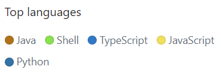
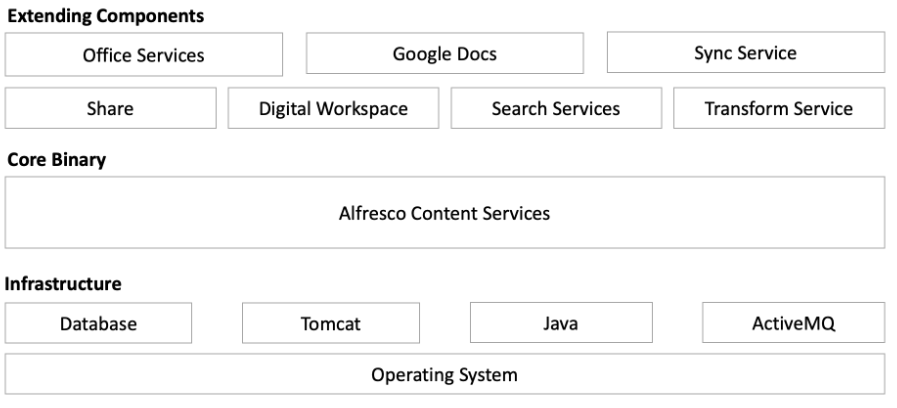
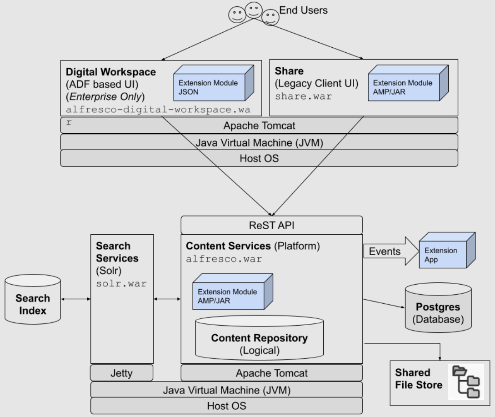
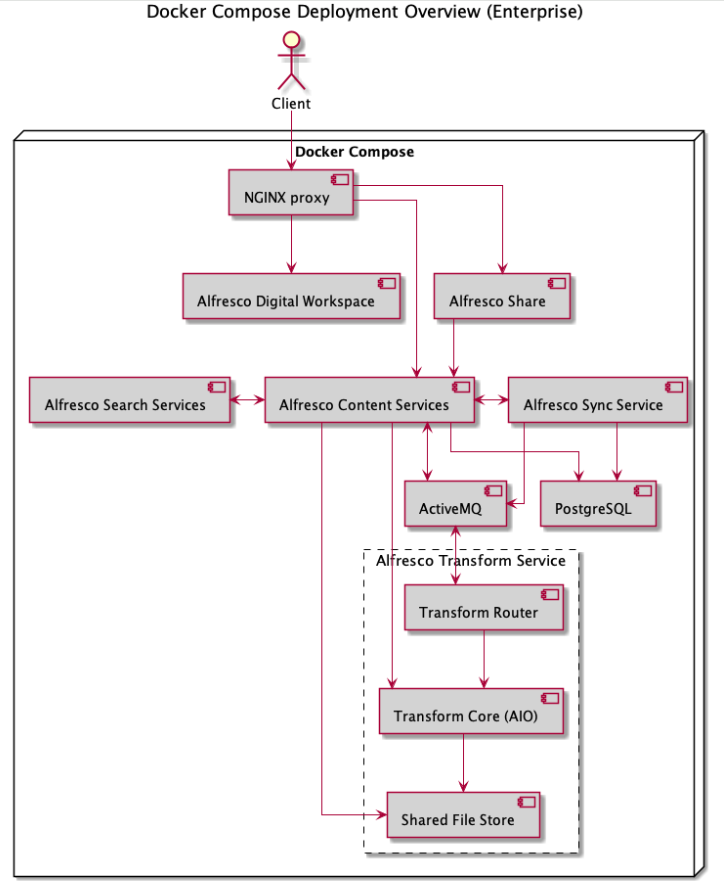
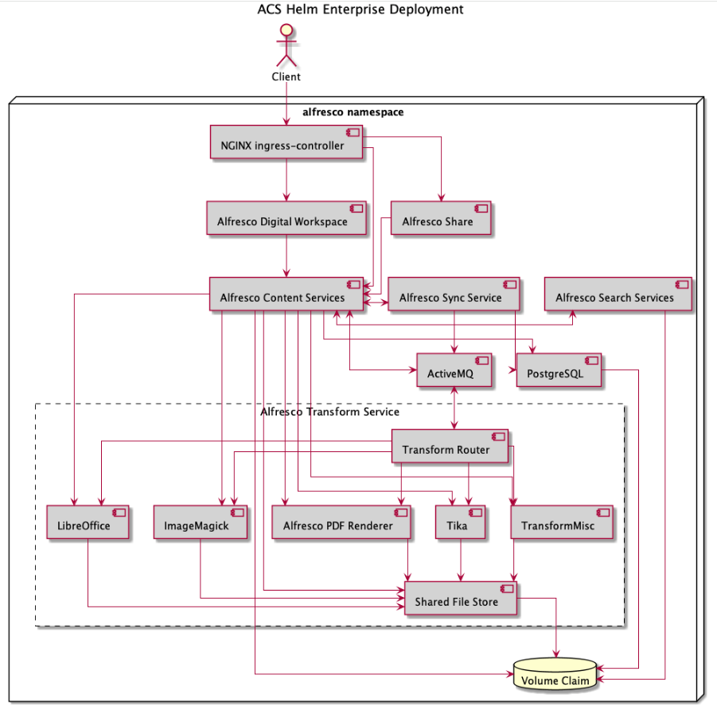
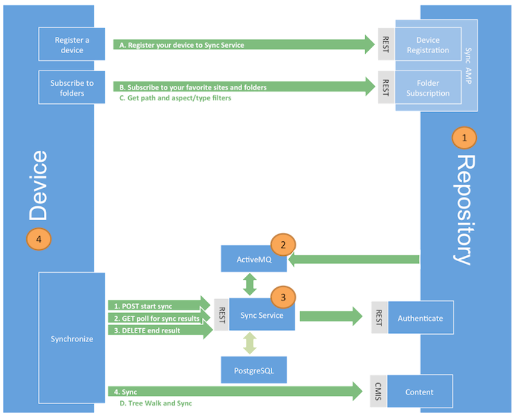
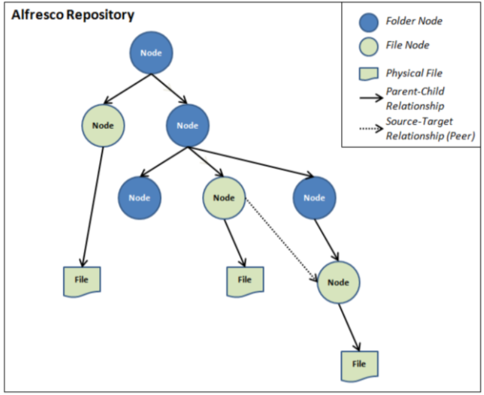
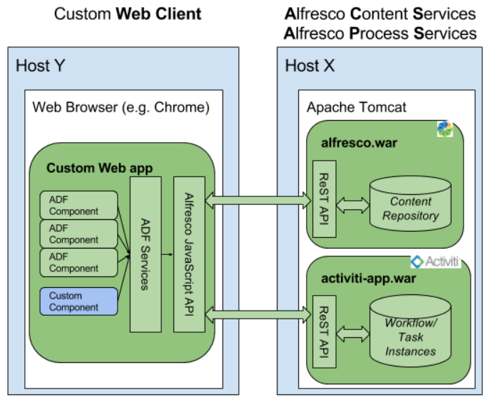
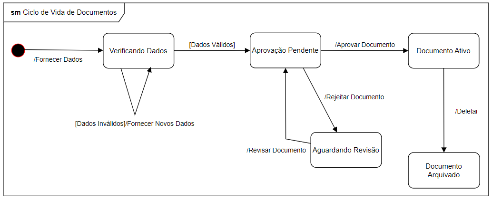

# Proj2ArquiteturaAlfresco

Disciplina: Arquitetura de Software

Professor: Diego Addan Gonçalves

\
\
**Alunos**

| Nome | RA |
| ---- | -- |
| Felippe Machado Nunes de Oliveira | 2347946 |
| Joice Kelly Oliveira Mendes | 2348020 |
| Lucas Costa Fuganti | 2209675 |

## 1. Introdução

Este documento tem por objetivo apresentar uma pesquisa feita como estudo de caso sobre a plataforma Alfresco, com o intuito de documentar e mapear os requisitos e processos ligados à arquitetura em camadas do sistema e, após a análise, sugerir uma possível melhoria para escalabidade ou refatoração da aplicação ou de algum de seus módulos.

A pesquisa é parte do processo avaliativo para a disciplina de Arquitetura de Software, ministrada na Universidade Tecnológica Federal do Paraná (UTFPR) do câmpus de Cornélio Procópio.

O documento está organizado em seções, sendo esta destinada à introdução ao documento em si e ao seu propósito. As seções subsequentes serão destinadas à apresentação geral do software escolhido (sistema Alfresco), à análise detalhada de sua arquitetura e as camadas que compõem a mesma, à uma análise crítica do sistema como um todo e uma sugestão para possível melhoria, às conclusões do grupo, e por fim uma seção com as referências utilizadas para a pesquisa.

Na seção a seguir, será apresentada uma visão geral a plataforma Alfresco.

## 2. Descrição geral do sistema

A plataforma Alfresco é um sistema de gestão de conteúdo empresarial multi plataforma de código aberto, que propõe ser uma alternativa para o gerenciamento de documentos, arquivos e conteúdos distribuídos pela *web*, propondo a colaboração. O código para a Alfresco é desenvolvido na linguagem Java.

O sistema Alfresco foi criado em 2005, e vem evoluindo constantemente desde então, contando com vários repositórios na plataforma GitHub para diversos propósitos, como repositórios dedicados à documentação e repositórios para a comunidade. A imagem a seguir apresenta as principais linguagens utilizadas atualmente nos diversos repositórios Alfresco.

Principais linguagens utilizadas nos repositórios Alfresco

### 2.1.Visão geral do Alfresco

A plataforma Alfresco busca entregar serviços de gestão de conteúdo empresarial, compreendendo o contexto nativo de aplicações em nuvem. O serviço se propõe a permitir um acesso fácil e rápido a qualquer tipo de informação desejada dos serviços que fazem uso da plataforma. A plataforma também tem o objetivo de ser de fácil integração, por ser construída também com base em APIs e padrões abertos.

O Alfresco oferece integração com serviços de diversos setores, como saúde, finanças, serviços goveramentais, educação e entretenimento. Dentre as empresas que utilizam os serviços, pode-se encontrar grupos reconhecidos no contexto de computação, como no caso da Cisco. Também conta com um sistema de suporte constante para operações críticas de negócios.

A instalação dos serviços de conteúdo Alfresco consiste no uso de diversos módulos que devem ser implantados e configurados juntos, para compor a plataforma de serviços como um todo. O objetivo é favorecer a flexibilidade para os usuários na etapa de configuração da arquitetura de modo a melhor acomodar a estratégia de cada empresa. A imagem a seguir apresenta um diagrama com os principais componentes para configuração do serviço.

Componentes para configuração típica do serviço

### 2.2. Escopo do estudo

Neste documento, o foco do estudo será abordar a arquitetura de software da plataforma Alfresco, detalhando seus diferentes níveis e apresentando o funcionamento e entendimento da mesma da perspectiva de desenvolvedores que buscam utilizar os serviços da plataforma Alfresco.

Assim, a seção a seguir tratará do sistema como um todo, considerando sua arquitetura e a integração de seus diversos componentes. Considerações sobre funcionamento de arquivos de código individuais não serão portanto o foco desta pesquisa.

## 3. Arquitetura do sistema Alfresco

Nesta seção será abordada a arquitetura dos serviços de gestão de conteúdo Alfresco considerando a perspectiva de um desenvolvedor.

### 3.1. Arquitetura em alto nível

A arquitetura de alto nível tem tradicionalmente feito uso de componentes como a plataforma, a interface de usuário, e um mecanismo de busca. Os componentes são implementados separadamente como aplicações *web*.

Para o sistema Alfresco, o componente principal, denominado plataforma, fornece um repositório onde o conteúdo é armazenado, bem como todos seus serviços associados como classificação e versionamento. Módulos AMP ou JAR podem ser utilizados para configurar e customizar a plataforma.

A interface de usuário é providenciada por um cliente *web* denominado Alfresco Share; há também um cliente de interface mais recente denominado Digital Workspace baseado no *Application Development Framework* (ADF) do sistema Alfresco. As interfaces de usuário facilitam a manipulação e gerenciamento dos sites e seus conteúdos.
Ambos oferecem opções de customização para interface por meio de pontos de extensão, em formatos AMP ou JAR para o caso do Alfresco Share, e em formato JSON para o caso do Digital Workspace.

A funcionalidade de mecanismo de busca é implementada sobre o Apache Solr e oferece indexação para todo o conteúdo, sendo também acessível por clientes móveis com o uso de APIs REST.

Todas as opções de customização permitem a criação de domínios focados nos casos de uso específicos para cada contexto.

Os componentes de plataforma e de interface de usuário são executados no mesmo servidor de aplicações *web* Apache Tomcat baseado na linguagem Java, mas também é possível utilizar demais linguagens ao trabalhar com extensões. Já o componente do mecanismo de busca é executado em servidor de aplicações *web* Jetty.

A imagem a seguir apresenta uma representação dessa arquitetura.

Arquitetura em alto nível

### 3.2. Arquitetura detalhada

Nesta seção a Arquitetura do sistema Alfresco será discutida com mais detalhes.

#### 3.2.1. Serviço de transformação

Além dos componentes mencionados na arquitetura em alto nível, há também o componente de serviço de transformação, composto por um roteador e vários "T-motores". Esse serviço é usado para transformar documentos enviados ao serviço em diversos formatos, dependendo do seu propósito de uso, como uma prévia, texto para indexação, ou imagem. Os motores de transformação ("T-motores") executam transformações em um único passo, enquanto o roteador permite transformações em vários passos, que combinam vários passos em um *pipeline* com um mecanismo de redundância para tentar diversas alternativas até que uma seja bem sucedida.

Ambos o roteador de transformação e os diversos T-motores são executados separadamente em contêineres Docker escaláveis, sendo o roteador conectado ao repositório de Serviços de Conteúdo Alfresco, e os T-motores por meio do agente de mensagens ActiveMQ, que trata das requisições e respostas das trasformações. O agente de mensagens é assíncrono, fazendo de suas requisições e respostas também assíncronas.

Para casos em que seja necessário trabalhar com mensagens síncronas, o repositório se comunica diretamente com os T-motores por HTTP, contando também com o mesmo *pipeline* em mecanismos de redundância que o roteador. O uso síncrono dos T-motores é chamado de transformações locais, sendo estas transformações as únicas disponíveis para a Edição da Comunidade do Alfresco, sendo usadas tanto para requisições síncronas quanto assíncronas.

Arquivos transformados ou retornados ao repositório geralmente são armazenados no *Shared File Store*. A imagem a seguir apresenta os componentes do serviços de transformação e suas relações.

Componentes do serviço de transformação

Vários T-motores podem ser implantados simultaneamente, embora geralmente para implantações menores seja usado um T-motor geral que provê as principais transformações de cinco outros T-motores. Em implantações de grande porte, é recomendável o uso de T-motores separados, cada um com sua própria imagem Docker. O T-motor geral é a opção padrão para implantação e instalação com Docker Compose, enquanto implantações Kubernetes com Helm ainda usam cinco T-motores diferentes a fim de equilibrar saída e melhorias de escalabilidade. T-motores adicionais também podem ser adicionados ao funcionamento. A imagem a seguir apresenta a implantação com Helm.

Implantação com Helm

#### 3.2.2. Serviço de sincronização Desktop Sync

Há também o Desktop Sync, que utiliza serviços de sincronização para permitir que usuários em plataformas desktop sincronizem o conteúdo de sua plataforma com aquele nos Serviços de Conteúdo Alfresco. A sincronização é feita de forma automática para ambos os lados, facilitando o compartilhamento de informação entre dispositivos, permitindo atualizações automáticas e fáceis, bem como auxiliando no processo de backup dos dados.

O serviço de sincronização é um módulo adicional para sincronizar arquivos entre a plataforma desktop e o repositório utilizando serviços *web*. Seus principais benefícios incluem:

- Clusterização para suportar escalabilidade;
- Suporte para vários bancos de dados como PostgreSQL, Oracle, MySQL, AWS Aurora MySQL;
- Suporte para implantação AWS;
- Monitoramento de eventos para conteúdo, governança e alterações de permissão.

Os componentes principais do Desktop Sync são:

1. O repositório de conteúdo, onde arquivos, índices e o banco de dados são encontrados;
2. Active MQ, onde o repositório Alfresco registra mensagens de alterações em arquivos, pastas, e registros de dispositivos;
3. Sync Service, um serviço que mantém informações de todas as mudanças, gerenciando um conjunto de dispositovos e computando as diferenças entre as cópias neles presentes, e a cópia no repositório Alfresco;
4. Dispositivos desktop usados pelos usuários.

O processo de sincronização é baseado no conceito de que o repositório publica mensagens quando eventos que podem ser de interesse aos clientes acontecem. Os clientes então fazem requisições para os eventos relevantes e usam a informação para se manterem sincronizados com o repositório. O repositório Alfresco comunica quaisquer mudanças feitas aos arquivos, pastas ou registros de dispostiivos por meio de uma fila, cujas mensagens são lidas pelo serviço de sincronização e garante a persistência das mudanças no banco de dados. O serviço também determina e registra se as cópias dos dispositivos para algum arquivo específico difere da cópia do repositório. A sincronização é feita da seguinte forma:

1. O dispositivo faz uma requisição `GET` para o serviço de sincronização para obter atualizações sobre se houve mudanças desde a última sincronização;
2. O serviço de sincronização comunica as mudanças, se houverem, para o dispositivo;
3. O dispositivo usa CMIS (*Content Management Interoperability Services*) e os dados alterados do serviço de sincronização para sincronizar cliente e repositório.

A imagem a seguir apresenta o fluxo do serviço de sincronização.

Serviço de sincronização

#### 3.2.3. Repositório de conteúdo

O repositório de conteúdo Alfresco é similar a um banco de dados, porém também armazena as associações entre diversos itens, classificações e a estrutura de pastas e arquivos. Essa estrutura é armazenada no banco de dados, e não é refletida na estrutura interna de armazenamento de arquivos.

O repositório implementa vários serviços por meio da API REST Alfresco e protocolos do padrão CMIS. Alguns desses serviços são:

- Modelagem de estrutura de conteúdo;
- Operações CRUD para o conteúdo;
- Relacionamentos;
- Consultas;
- Permissões de acesso;
- Versionamento;
- Eventos;
- Regras e ações.

Em suma, o repositório é uma entidade lógica composta pelo conteúdo definido em arquivos enviados e armazenados no sistema de arquivos, os arquivos de indexação criados ao fazer o envio de um arquivo para que o mesmo possa ser rastreado, e os metadados e propriedades para cada arquivo, armazenados em um sistema de gerenciamento de banco de dados relacional. As pastas e arquivos dentro do repositório são referidos como "nós", mantidos em *Stores*. A imagem a seguir exemplifica a organização lógica dos nós em um *Store*.

Exemplo da estrutura lógica em um *Store*

Um repositório pode manter vários *Stores*, mas cada nó só pode estar localizado em um único *Store*. Os principais *Stores* são:

- **Working Store**: Contem os metadados para todos os nós ativos no repositório;
- **Content Store**: Contem os arquivos eviados para o repositório;
- **Archive Store**: Contem os metadados para nós que foram deletados;
- **Version Store**: Armazena metadados para nós aos quais foi aplicada a propriedada `versionable`;
- **System Store**: Salve informações sobre módulos de extensão dos Serviços de Conteúdo Alfresco instalados.

Apenas o Content Store é implementado de modo a armazenar itens no disco.

#### 3.2.4. Arquitetura da plataforma

Consiste no repositório, seus serviços relacionados e APIs. A plataforma contém pontos de extensão chave para a construção de extensões próprias. Os Serviços de Conteúdo Alfresco são modulares, implementando o framework Spring.

O repositório armazena documentos e demais tipos de conteúdo, sendo os itens de conteúdo, bem como suas relações, definidos em modelos. A modelagem de conteúdo especifica como os nós armazenados no repositório são organizados e restringidos, impondo uma estrutura formal nos nós que pode ser compreendida por uma aplicação. Os nós podem representar qualquer coisa armazenada no repositório, como pastas, arquivos, documentos, trechos XML, sites colaborativos ou mesmo pessoas. Cada nó é identificado por um ID único, e contem diversas propriedades, com cada propriedade podendo ser de qualquer tipo de dado, e possuir um ou vários valores. As relações entre nós definem a hierarquia na qual os mesmos são organizados no repositório.

A modelagem define as seguintes regras para a estrutura de dados:

- Um nó deve ser de um determinado tipo;
- Um nó deve possuir um conjunto enumerado de propriedades;
- Uma propriedade deve ser de um determinado tipo de dados;
- Um valor deve estar dentro de um conjunto definido de valores;
- Um nó deve estar relacionado a outros nós de alguma forma.

O repositório oferece serviços para a leitura, consulta e manutenção de nós. Mudanças disparam eventos, permitindo que sejam acionados processos. O uso de eventos assim permite a definição de políticas para lidar com eventos específicos para um tipo determinado de nó, ou eventos gerais para vários ou mesmo todos os nós, e também a declaração de regras baseadas na criação, atualização ou remoção de nós.

Como protocolos de acesso ao repositório de conteúdo, o Alfresco atualmente suporta HTTP, WebDAV, FTP, Alfresco Office Services, CMIS, IMAP, SMTP.

#### 3.2.5. Arquitetura da interface de usuário

A arquitetura de interface de usuário consiste em vários clientes *web* e na *Application Development Framework* (ADF) da Alfresco, sendo os clientes *web* gerenciados por opções como Alfresco Share e Digital Workspace, e a ADF, construída com o framework Angular da linguagem JavaScript, funcionando como uma biblioteca de componentes *web* da Alfresco, podendo ser usada para gerenciamento de conteúdo e processo *web*.

Alguns dos componentes *web* que podem ser integrados são:

- Hierarquia de pastas *Breadcrumbs*;
- Lista de documentos;
- Mecanismo de busca;
- Rótulos;
- Envio de arquivos;
- Visualização de prévias;
- *Webscripts*, como por exemplo por chamadas REST.

Os componentes ADF não se comunicam diretamente com os serviços backend Alfresco, existindo algumas camadas entre eles. Os componentes ADF se comunicam com os serviços ADF, que por sua vez trocam mensagens com a API JavaScript da Alfresco, que faz chamadas aos serviços backend com suas respectivas APIs. Os serviços ADF e a API JavaScript também podem ser utilizados diretamente caso não haja um componente disponível para uma determinada tarefa.

A imagem a seguir ilustra o processo de comunicação descrito.

Comunicação desde os componentes até os serviços backend

As páginas da interface de usuário são baseadas na aplicação Alfresco Share, que executa na plataforma Java, e geralmente é implantada com o uso do Apache Tomcat. Sua estrutura é baseada em um menu principal que leva às páginas, sendo semelhante ao padrão de páginas *web* de demais aplicações. Seu diferencial é o tipo de página *dashboard*, que pode ser configurada pelo usuário final a fim de adicionar, remover e organizar elementos na página.

As páginas, scripts e elementos dessas dashboards são implementados com uso do framework Surf, originalmente desenvolvido pela própria Alfresco, que fornece a modularização de uma página HTML ao segmentá-la em diversos componentes reutilizáveis. O framework Surf é construído sobre o Spring MVC.

### 3.3. APIs

Para acessar e extender serviços fora dos centrais oferecidos pelos sistemas Alfresco, os serviços de conteúdo possui dois tipos de APIs, cada uma destinada para um tipo específico de cliente. Essas categorias são as APIs remotas e as APIs embutidas.

A principal API remota é a API REST Alfresco, que deve ser o primeiro ponto de interação quando se deseja utilizar um repositório Alfresco remotamente. Para o caso de portabilidade, é possível utilizar APIs REST CMIS.

Baseada em padrões HTTP, a API facilita a integração com demais aplicações ao permitir que desenvolvedores interajam com o Alfresco para executar diversas operações, como operações CRUD.

Já as APIs embutidas tradicionalmente tem sido usadas para definir customizações que executam na mesma máquina virtual Java que o repositório Alfresco. Algumas das principais são:

- **Node Service**, uma API para gerenciamento e manipulação de nós;
- **Content Service**, que provê funções de configuração, acesso e transformação de conteúdo;
- **Search Service**, que encapsula as buscas para diversos mecanismos, reconhecendo várias linguagens de consulta;
- **Person Service**, uma API para gerenciamento de usuários e grupos;
- **Workflow Service**, usada para interagir com workflows dentro do Alfresco, sendo possível gerenciar tarefas e acompanhar processos.

### 3.4 Diagramas desenvolvidos
A seguir estão alguns diagramas UML desenvolvidos pelo grupo sobre alguns processos do sistema Alfresco.
Diagrama de Máquina de Estados que ilustra o ciclo de vida de documentos no Alfresco:

Diagrama de Máquina de Estados sobre o Ciclo de Vida de Documentos

Diagrama de sequência sobre alguns fluxos de interações no sistema:

Diagrama de Sequência sobre autenticação, navegação, sincronização, busca e transformação de documentos.

## 4. Sugestões de Melhoria
### 4.1 Criação de um chatbot com genIA para suporte
- Atendimento 24/7;
- Redução da carga de trabalho da equipe de suporte;
- Acesso rápido e fácil à informação;
- Personalização da experiência;
- Integração com diversas fontes de informação;
- Capacidade de gerar conteúdo;
- Análise de dados e insights;
- Escalabilidade;
- Multilinguismo.

Além dos beneficios citados acima a integração do ChatBot com GenAI utilizando RAG - Retrieval Augment Generation para otimização da busca - O chatbot pode utilizar a capacidade de processamento de linguagem natural da GenAI para realizar buscas mais precisas e relevantes dentro da base de conhecimento do Alfresco.

As Bases de Conhecimento para Amazon Bedrock permitem integrar informações proprietárias nos aplicativos de IA generativa. Usando a técnica Retrieval Augment Generation (RAG), uma base de conhecimento pesquisa seus dados para encontrar as informações mais úteis e, em seguida, as usa para responder a perguntas em linguagem natural, ao utilizar API RetrieveAndGenerate ou API Retrieve.

API RetrieveAndGenerate: Combina dois passos em uma única chamada:
- Recuperação (Retrieve): Busca informações relevantes da base de conhecimento com base na pergunta ou contexto fornecido.
- Geração (Generate): Usa essas informações recuperadas junto com a pergunta original para gerar uma resposta.

API Retrieve: Realiza apenas o passo de recuperação:
- Consulta a base de conhecimento e retorna as informações mais relevantes para a pergunta ou contexto fornecido.
- Não gera uma resposta, apenas fornece as informações recuperadas.
Isso pode ser útil para:
- Ter mais controle sobre como as informações são usadas.
- Realizar processamento adicional nos dados recuperados antes de gerar uma resposta.
- Mostrar ao usuário as fontes de informação exatas que estão sendo usadas.

### 4.2 Implementação de RAG (Retrieval Augmented Generation) com AWS Bedrock
O diagrama apresentado ilustra um fluxo típico de RAG, que pode ser implementado utilizando os serviços do AWS Bedrock.

RAG components

1. Extração
Data Source

Bedrock: Integre várias fontes de dados (documentos, imagens, vídeos) usando Amazon S3 ou outros serviços de armazenamento da AWS.

Chunk Content
Bedrock: Utilize modelos de fundação do Bedrock para processar e dividir o conteúdo em chunks gerenciáveis.

Create Embedding
Bedrock: Aproveite modelos de embedding para criar representações vetoriais do conteúdo.

Vector DB
Bedrock: Armazene embeddings em um banco de dados vetorial compatível, como Amazon OpenSearch ou alternativas de terceiros.

2. Recuperação
Prompt

Bedrock: Utilize a interface do Bedrock para receber prompts do usuário.

Apply Input Moderator
Bedrock: Implemente moderação de entrada usando modelos específicos do Bedrock para garantir conteúdo apropriado - Como Bedrock Guardrails.

Create Embedding
Bedrock: Use o mesmo modelo de embedding para vetorizar o prompt do usuário.

Match and Retrieve Chunks
Bedrock: Execute busca semântica no banco de dados vetorial para encontrar chunks relevantes.

Top-k Chunks
Bedrock: Selecione os chunks mais relevantes para enriquecer o contexto da geração.

3. Geração
Prompt

Bedrock: Construa um prompt enriquecido combinando a consulta original e os chunks recuperados.

Completion API
Bedrock: Utilize modelos de linguagem para gerar respostas contextualizadas.

Apply Output Moderator

Bedrock: Aplique moderação de saída para garantir respostas apropriadas e seguras.

Response
Bedrock: Entregue a resposta final ao usuário através da interface escolhida.

Implementação com AWS Bedrock

Preparação de Dados: Use Amazon S3 para armazenar seus dados brutos.
Processamento: Utilize AWS Lambda com modelos do Bedrock para chunking e embedding.
Armazenamento de Vetores: Implemente Amazon OpenSearch para armazenar e buscar embeddings.
Orquestração: Use AWS Step Functions para gerenciar o fluxo de RAG.
Interface: Crie uma API com Amazon API Gateway para interagir com o sistema.
Geração: Modelos de linguagem do Bedrock para criar respostas contextualizadas.

## 5. Referências

[Alfresco Digital Workspace](https://docs.alfresco.com/digital-workspace/latest/)
\
[Alfresco Share](https://docs.alfresco.com/content-services/latest/using/share/)
\
[API REST Alfresco](https://docs.alfresco.com/content-services/latest/develop/rest-api-guide/)
\
[Arquitetura da plataforma Alfresco](https://docs.alfresco.com/content-services/latest/develop/software-architecture/)
\
[Documentação oficial da plataforma Alfresco](https://docs.alfresco.com/content-services/latest/)
\
[GitHub da Alfresco Software](https://github.com/Alfresco)
\
[Hyland - Plataforma Alfresco](https://www.hyland.com/en/products/alfresco-platform)
\
[Hyland Customers - Cisco](https://www.hyland.com/en/customers/cisco)
\
[Instalação Alfresco](https://docs.alfresco.com/content-services/latest/install/)
\
[Integrações com Alfresco](https://www.hyland.com/en/solutions/integrations)
\
[Serviço de sincronização Alfresco](https://docs.alfresco.com/sync-service/latest/admin/)
\
[Serviço de transformação Alfresco](https://docs.alfresco.com/transform-service/latest/)
\
[RAG components]([https://docs.alfresco.com/transform-service/latest/](https://medium.com/@rajib76.gcp/aws-bedrock-retrieval-agent-part-1-e6d23fbb9708))

